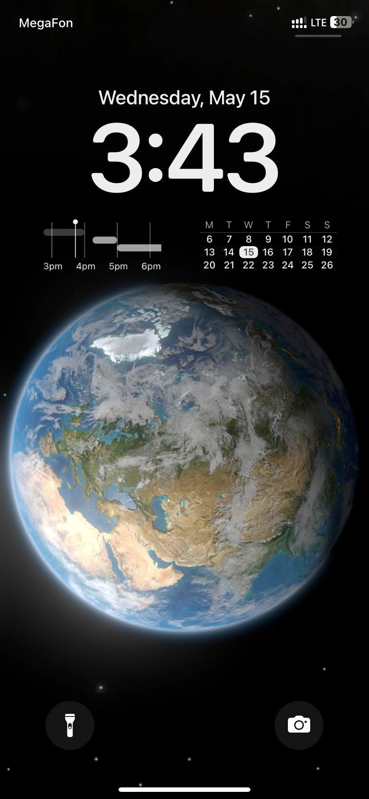

# ios-lockscreen-calendar-timeline-widget

This project is an iOS lock screen widget created using Scriptable. The widget displays a timeline with events from the iOS calendar.

## Installation

1. Download Scriptable from the App Store.
2. Copy the contents of the `widget.js` file.
3. Open Scriptable, create a new script, and paste the copied code.
4. Set up the widget on the iOS lock screen by selecting the created script.

## Usage

1. Add the widget to the lock screen.
2. The widget will display upcoming events from your calendar.

## Notes

- Ensure that Scriptable has access to your iOS Calendar.
- The widget updates automatically every few minutes.
